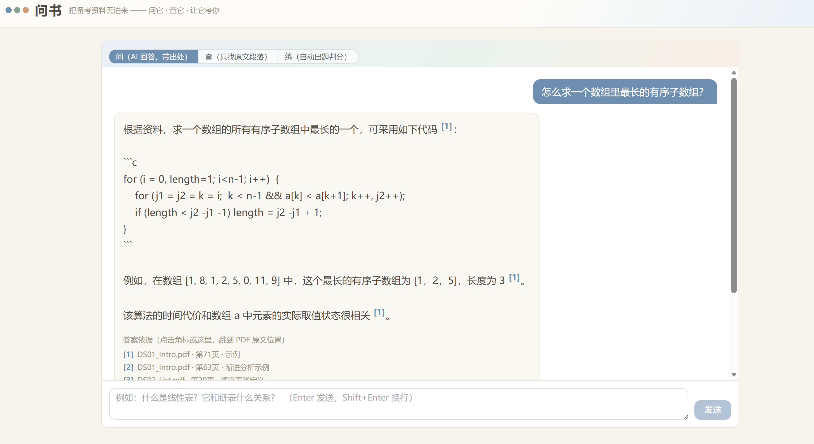
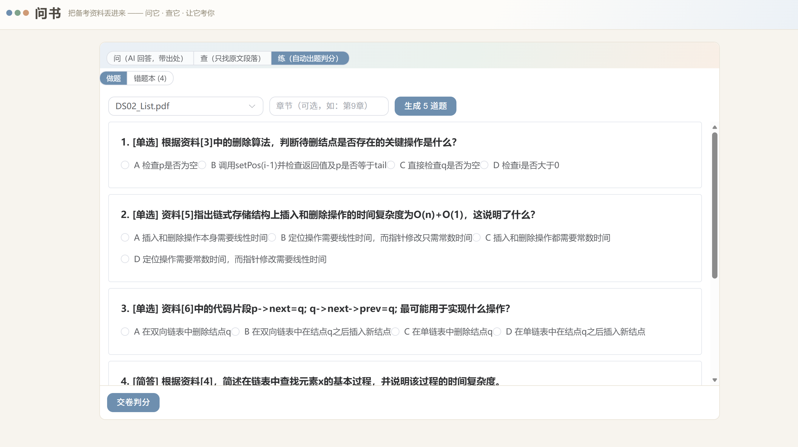
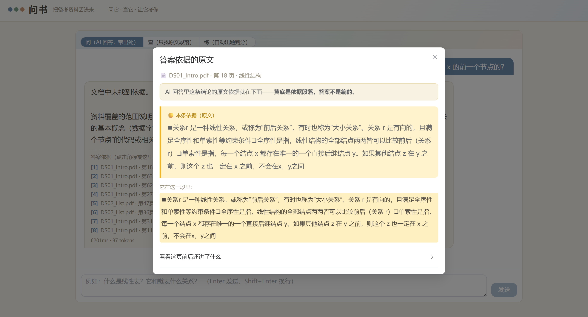

<div align="center">

# 问书 DocMind

**备考资料 AI 助教 — 每个答案都有出处**

[](https://spring.io)
[](https://www.postgresql.org)
[](https://vuejs.org)
[](https://onnxruntime.ai)
[](LICENSE)

把教材、讲义、真题丢进知识库，然后——**问它、查它、让它考你**。

</div>

---

## ✨ 功能特性

| 功能 | 说明 |
|---|---|
| 🧠 **问** — AI 回答带出处 | 流式回答 + `[n]` 角标，点击直达 PDF 原文段落，资料里没有的明确拒答 |
| 🔍 **查** — 原文定位 | 丢半句记不全的话、一个术语，直接定位到原文段落（语义匹配，不是 Ctrl+F） |
| 📝 **练** — 自动出题判分 | 圈定章节生成练习题，答完 LLM 判分，指出你漏了原文哪句 |
| 📕 **错题本** | 交卷自动存档，跨练习收集做错的题，随时回顾 |
| 🔗 **口令共享** | 同学输一次口令即可共用资料库，支持跨设备 |
| 📊 **检索调试台** | 召回漏斗 + 四列得分（向量/关键词/RRF/Rerank）+ 耗时拆解，全程可视化 |
| 🧪 **消融实验** | 6 配置 × 50 题，一键跑出对比表 |
| 📄 **分片预览** | 上传前看文档被切成什么样，不好换策略重切 |

---

## 📸 项目截图

<!-- 截图占位：实际使用后拍摄放入 docs/screenshots/ 目录 -->

| 问 · AI 回答带引用 | 查 · 原文定位 |
|:---:|:---:|
|  |  |

| 练 · 出题判分 | 原文阅读卡 |
|:---:|:---:|
|  |  |

| 检索调试台 | 消融实验面板 |
|:---:|:---:|
|  |  |

---

## 📊 实验结果

### 消融实验（6 配置 × 50 题，教材语料）

| 配置 | HitRate@5 | MRR | 说明 |
|---|---:|---:|---|
| ① 固定长度 + 纯向量 | 93.0% | 0.748 | 基线 |
| ② 递归分隔符 + 纯向量 | 95.4% | 0.724 | 断在自然边界 |
| ③ 结构感知 + 纯向量 | 90.7% | 0.572 | 口径更严 |
| ④ ③ + 父子分块 | 95.4% | 0.729 | Small-to-Big |
| ⑤ ④ + 双路召回 + RRF | 97.7% | 0.765 | 语义+关键词互补 |
| ⑥ ⑤ + Rerank 精排 | 97.7% | **0.942** | **MRR +23%** |

> **核心发现**：Rerank 不提升召回率（HitRate 持平），但把 MRR 从 0.765 拉到 0.942——交叉编码器的价值在**排序质量**而非找得更多。

### 生成质量（LLM 裁判，43 题）

| 指标 | 结果 |
|---|---|
| 忠实度 | **100%** — 所有回答的结论全部有原文依据 |
| 引用准确率 | 71.9%（115/160 角标真正支撑结论） |
| 正确拒答率 | 42.9%（库外问题不编造） |

---

## 🏗 技术架构

```
┌─────────────────────────────────────────────────────┐
│                    用户浏览器                         │
│            Vue 3 + Element Plus + SSE               │
└──────────────────────┬──────────────────────────────┘
                       │ HTTP / SSE
┌──────────────────────▼──────────────────────────────┐
│              Spring Boot 3 (端口 8080)               │
│                                                     │
│  ┌─────────┐   ┌──────────┐   ┌─────────────────┐  │
│  │ 离线链路 │   │ 在线链路  │   │   产品功能       │  │
│  │ 解析器   │   │ 双路召回  │   │   问/查/练      │  │
│  │ 分片器   │→→ │ RRF融合   │→→ │   出题判分      │  │
│  │ 向量化   │   │ Rerank   │   │   错题本        │  │
│  └─────────┘   │ 拒答判断  │   │   口令共享      │  │
│                └──────────┘   └─────────────────┘  │
│                                                     │
│  ┌─────────────────┐  ┌──────────────────────────┐  │
│  │  ONNX Runtime   │  │       DeepSeek API       │  │
│  │  bge-small-zh   │  │    流式生成 (SSE)        │  │
│  │  bge-reranker   │  └──────────────────────────┘  │
│  │  (CPU, 无GPU)   │                                │
│  └─────────────────┘                                │
└───────┬─────────────────────┬───────────────────────┘
        │                     │
┌───────▼───────┐    ┌───────▼───────┐
│  PostgreSQL   │    │     Redis     │
│  17 + pgvector│    │   限流/缓存    │
│  + jieba全文  │    │               │
└───────────────┘    └───────────────┘
```

### 检索链路（核心）

```
问题 → 向量召回(50) + 关键词召回(50)     双路互补
     → RRF 融合(30)                     无需调权的排名合并
     → Rerank 精排(10留8)               交叉编码器逐对打分
     → 拒答判断(最高分<0.35?)           防止编造
     → Small-to-Big 父块组装(≤4块)      子块检索，父块返回
     → DeepSeek 流式生成                 SSE 推送
```

---

## 📦 技术栈

**后端**：Spring Boot 3.x（JDK 21）、Spring Data JPA + JdbcTemplate、Flyway、WebFlux（SSE 流式）

**前端**：Vue 3 + Composition API、Vite、TypeScript、Element Plus、Pinia

**AI / ML**：
| 组件 | 用途 | 运行方式 |
|---|---|---|
| bge-small-zh-v1.5 | 文本向量化（512维） | ONNX Runtime，CPU |
| bge-reranker-base | 交叉编码器精排 | ONNX Runtime，CPU（int8量化） |
| DeepSeek API | 流式文本生成 | REST API |
| jieba | 中文分词 | Java 库 |

**存储**：PostgreSQL 17 + pgvector（向量+全文+业务数据单库）、Redis（限流/缓存）

---

## 🔧 技术决策

| 决策 | 选择 | 为什么不选替代方案 |
|---|---|---|
| 向量库 | PostgreSQL + pgvector | 20万块内同库同事务最简；Milvus 杀鸡用牛刀 |
| RAG 框架 | **自研** | LangChain 默认分片不适配中文/表格；封装深无法做消融实验 |
| 分词器 | **纯 Java 自研** | DJL Rust 库在真实语料上 panic 杀 JVM（见排障记录） |
| 生成模型 | DeepSeek API | 中文效果好、便宜（全部实验花费 < ¥5） |
| 部署 | Docker Compose | 单命令启动全部服务 |

---

## 🚀 快速开始

### 前置条件

- JDK 21
- Docker
- Node.js 18+
- DeepSeek API Key（[免费注册](https://platform.deepseek.com)）

### 启动

```bash
# 1. 克隆项目
git clone https://github.com/Sunly9/wenshu.git
cd wenshu

# 2. 启动数据库
docker compose -f deploy/docker-compose.dev.yml up -d

# 3. 下载嵌入模型（约 95MB）
mkdir -p backend/models/bge-small-zh-v1.5
curl -L -o backend/models/bge-small-zh-v1.5/model.onnx \
  https://hf-mirror.com/Xenova/bge-small-zh-v1.5/resolve/main/onnx/model.onnx
curl -L -o backend/models/bge-small-zh-v1.5/tokenizer.json \
  https://hf-mirror.com/Xenova/bge-small-zh-v1.5/resolve/main/tokenizer.json

# 4. 下载重排模型（约 279MB，可选）
mkdir -p backend/models/bge-reranker-base
curl -L -o backend/models/bge-reranker-base/model.onnx \
  https://hf-mirror.com/Xenova/bge-reranker-base/resolve/main/onnx/model_quantized.onnx
curl -L -o backend/models/bge-reranker-base/tokenizer.json \
  https://hf-mirror.com/Xenova/bge-reranker-base/resolve/main/tokenizer.json

# 5. 配置 API Key
export DEEPSEEK_API_KEY=sk-your-key-here

# 6. 启动后端（首次启动自动建表）
cd backend && mvn spring-boot:run

# 7. 启动前端（另开终端）
cd frontend && npm install && npm run dev
```

打开 `http://localhost:5173`，建库 → 上传 PDF → 开始提问。

---

## 📡 主要接口

| 方法 | 路径 | 说明 |
|---|---|---|
| POST | `/api/kb` | 创建资料库（自动生成口令） |
| GET | `/api/kb` | 资料库列表（按访客过滤） |
| POST | `/api/kb/join` | 通过口令加入资料库 |
| POST | `/api/kb/{id}/documents` | 上传文档（异步解析） |
| GET | `/api/documents/{id}/status` | 解析进度 |
| POST | `/api/kb/{id}/chunks/preview` | 分片预览（不入库） |
| POST | `/api/chat` | **提问**（SSE 流式） |
| POST | `/api/kb/{id}/locate` | **查**：原文定位 |
| POST | `/api/kb/{id}/quiz/generate` | **练**：生成练习题 |
| POST | `/api/kb/{id}/quiz/grade` | 判分（含漏句指出） |
| GET | `/api/kb/{id}/quiz/wrong` | 错题本 |
| POST | `/api/kb/{id}/debug-query` | 调试台：检索链即时执行 |
| POST | `/api/eval/run` | 消融实验跑批 |
| GET | `/api/chunks/{id}` | 原文阅读卡 |
| GET | `/api/kb/{id}/suggest-questions` | 示例问题（按库内容生成） |

---

## 📁 项目结构

```
wenshu/
├── backend/                          # Spring Boot 3 后端
│   └── src/main/java/com/docmind/
│       ├── api/                      # Controller / DTO / 全局异常
│       ├── ingest/                   # 离线链路
│       │   ├── parser/               # PdfParser / MarkdownParser / WordParser
│       │   ├── chunker/              # 4 种分片策略 + 共享组件
│       │   └── pipeline/             # 编排 + 状态机 + 断电恢复
│       ├── index/                    # 向量化 / 全文索引 / 自研分词器
│       ├── retrieve/                 # 在线链路
│       │   ├── recall/               # VectorRecall / FtsRecall
│       │   ├── fusion/               # RrfFusion (k=60)
│       │   ├── rerank/               # OnnxRerankClient (交叉编码器)
│       │   └── assembler/            # Small-to-Big 父块组装
│       ├── generation/               # PromptBuilder / LlmClient / SSE
│       ├── quiz/                     # 出题 / 判分 / 错题本
│       ├── eval/                     # 消融Runner / 生成质量评测
│       └── observability/            # QueryLog / DebugService
├── frontend/                         # Vue 3 + Vite + TS + Element Plus
│   └── src/views/                    # 4 个页面
├── deploy/                           # Docker Compose / Nginx
├── docs/                             # 设计文档（含冻结规格）
│   ├── 00-项目定稿-v1.0.md           # DDL / API / 参数 / 评测方案
│   ├── 03-总体设计与开发计划.md       # 架构设计 + 21 天排期
│   └── 用户手册.md                    # 产品定义
└── .github/workflows/                # CI/CD（部署时启用）
```

---

## 🔐 安全说明

- `DEEPSEEK_API_KEY` 通过环境变量注入，**不入库不入 Git**
- 匿名访客体系（无注册），localStorage UUID 标识身份，口令共享代替账号系统
- 按 IP 限流（Redis）：提问 50 次/天，口令验证 10 次/小时
- 上传限制：仅 PDF/Word/Markdown，单文件 ≤ 50MB，单库 ≤ 100 文档

---

## 📝 License

MIT © [Sunly9](https://github.com/Sunly9)

---

<div align="center">

**如果这个项目对你有帮助，点个 ⭐ Star**

</div>
