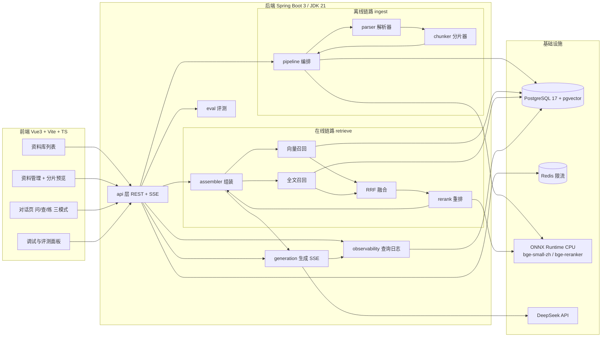

# 问书（DocMind）总体设计与开发计划

> 本文是 `00-项目定稿-v1.0.md` 的**执行层设计**：规格已冻结的部分不重复论证，只回答"具体怎么建、先建什么、怎么验收"。
> 所有与 00 号文档冲突之处，以 00 号文档为准。

---

## 一、总体架构

### 1.1 系统分层



### 1.2 两条链路一句话

- **离线链路（写）**：上传 → 解析成结构化元素 → 分片（子块+父块）→ 向量化 + 分词 → 落库 `chunk` 表。
- **在线链路（读）**：提问 → 双路召回各 50 → RRF 融合 30 → Rerank 留 8 → 合并去重成 4 个父块 → 组装 Prompt → DeepSeek 流式生成 → SSE 推给前端 → 全程打分落 `query_log`。

---

## 二、工程结构（monorepo）

```
wenshu/
├── backend/                     # Spring Boot 3.x, JDK 21
│   ├── src/main/java/com/docmind/
│   │   ├── api/                 # controller / dto / GlobalExceptionHandler
│   │   ├── ingest/
│   │   │   ├── parser/          # PdfParser MarkdownParser WordParser WebParser
│   │   │   ├── chunker/         # FixedSize / Recursive / StructureAware / Semantic
│   │   │   └── pipeline/        # IngestPipeline（编排 + 状态机 + 进度）
│   │   ├── index/               # EmbeddingClient(VectorStore侧) FullTextIndex TokenCounter
│   │   ├── retrieve/            # recall / fusion / rerank / assembler
│   │   ├── generation/          # PromptBuilder LlmClient SseChatController 逻辑
│   │   ├── quiz/                # 出题与判分（M3 新增包）
│   │   ├── eval/                # DatasetLoader MetricsRunner ReportService
│   │   ├── observability/       # QueryLogService
│   │   └── common/              # config / ratelimit / 枚举
│   ├── src/main/resources/db/migration/   # Flyway V1__init.sql（即 00 号 DDL）
│   └── src/test/java/           # 分片器金样例测试 + Testcontainers 集成测试
├── frontend/                    # Vue 3 + Vite + TS + Element Plus
│   └── src/
│       ├── views/               # KbListView / KbDetailView / ChatView / DebugView
│       ├── components/          # chat/ quiz/ preview/ debug/ 公共组件
│       ├── api/                 # axios 封装 + SSE 解析器（fetch + ReadableStream）
│       ├── stores/              # Pinia：visitor / kb / chat
│       └── router/
├── deploy/
│   ├── docker-compose.dev.yml   # 本地只起 pgvector + redis
│   ├── docker-compose.prod.yml  # 已有
│   └── nginx/                   # 已有
├── docs/                        # 00~03 + 用户手册
└── .github/workflows/ci.yml     # 构建 → 测试 → GHCR → SSH 部署
```

> 在 00 号包结构基础上新增 `quiz` 包（出题判分），其余不动。

---

## 三、核心数据结构（进程内）

解析与分片之间约定统一中间结构，所有 Parser 输出它，所有 Chunker 消费它：

```java
// 解析产物：文档 = 有序元素流
record ParsedDocument(
    String fileName,
    int pageCount,
    List<ParsedElement> elements
) {}

record ParsedElement(
    ElementType type,      // HEADING / PARAGRAPH / TABLE / LIST / CODE
    String text,           // 表格序列化为 Markdown 表格文本
    int level,             // HEADING 专用：1~4
    int pageNo
) {}

// 分片产物
record ChunkDraft(
    String content,
    int tokenCount,
    String sectionPath,    // 如 "第三章 进程管理 > 3.2 调度算法"
    Integer pageNo,
    int chunkIndex,        // 文档内自增，父块子块统一编号
    Long parentDraftId     // null = 自己是父块
) {}
```

**关键约定：**

- **token 计数统一用 bge 的 HuggingFace tokenizer**（和向量化同一个），保证"子块 320 token"这个约束前后一致。DeepSeek 的 token 数只从 API `usage` 读回来记账，不用它做分片预算。
- **表格永远是一个 ParsedElement**，序列化成 Markdown 表格文本；超过 320 token 的大表整块保留、不切，并在评测集的 8 道表格题里验证。
- **页眉页脚剔除**在 Parser 内完成：对每页顶部/底部区域出现的跨页重复行做模式归并后丢弃。

---

## 四、离线链路设计

### 4.1 文档状态机

```
PENDING ──► PARSING ──► INDEXING ──► READY
   │           │            │
   └───────────┴────────────┴──────► FAILED(error_msg)
```

- 上传接口立即返回 `documentId`（状态 PENDING），任务提交到**进程内 `ThreadPoolTaskExecutor`**（核心 2 线程，解析是 CPU/IO 混合型，够用；不引入 MQ，写进 README 的取舍）。
- 进度百分比：PARSING 阶段 = 已解析页数/总页数 × 40%；INDEXING 阶段 = 40% + 已入库块数/总块数 × 60%。
- **服务重启的恢复策略**：启动时扫描所有非终态文档，统一置 FAILED（"服务重启导致中断，请重新上传"）。简单、诚实、可演示。

### 4.2 四种分片器（一接口四实现）

```java
public interface Chunker {
    List<ChunkDraft> chunk(ParsedDocument doc);
}
```

| 实现 | 算法要点 |
|---|---|
| `FixedSizeChunker` | 按 token 数硬切，无重叠。**只作消融基线** |
| `RecursiveChunker` | 依次尝试 `\n\n` → `\n` → `。` → `；` 找断点，直到块 ≤ 320 |
| `StructureAwareChunker`（主策略） | 见下 |
| `SemanticChunker`（M3 可选） | 逐句向量化，相邻余弦相似度低于均值-1σ 处断句 |

**StructureAwareChunker 伪代码：**

```
sectionStack = []                       # 维护标题栈 → sectionPath
parent = newParent()                    # 当前父块（1024 token 预算）
for el in elements:
    if el is HEADING:
        弹栈至 el.level，压入 el.text
        parent 尝试收尾（父块预算内独立成段）
    elif el is TABLE:
        整块作为一个子块（不切），独占或共享父块
    else:  # PARAGRAPH / LIST / CODE
        if el.tokenCount > 320: 递归细分（复用 RecursiveChunker 的断点逻辑）
        攒进 parent；父块超 1024 token 则开新父块
子块间加 15% overlap（约 48 token，从上一子块尾部回抄整句）
```

**父子分块落库形态**：同一张 `chunk` 表，父块 `parent_id = null` 且**不建向量索引、不建 tsv**（embedding/content_tsv 为 NULL），子块带 `parent_id`。检索只命中子块，命中后取父块给模型。

### 4.3 向量化与全文索引

- **EmbeddingClient**：`onnxruntime` + `ai.djl.huggingface:tokenizers` 加载 bge-small-zh-v1.5 ONNX。批处理（batch=32），mean pooling + L2 归一化，输出 512 维。**冷启动加载约 2~3 秒，做成单例 Bean**。
- **FullTextIndex**：jieba 分词 → 空格连接 → `to_tsvector('simple', :tokens)` 写入 `content_tsv`。查询侧同样 jieba 分词后 `plainto_tsquery('simple', :qtokens)`，`ts_rank_cd` 排序。
- 写库用 `JdbcTemplate` 批量 upsert（`unnest` 批插），不经过 JPA——vector/tsvector 列 JPA 映射麻烦且无谓。

---

## 五、在线链路设计

### 5.1 检索链（可按配置裁剪，消融实验就靠这个开关）

```java
record RetrievalConfig(
    boolean useFts,          // 关 = 纯向量（消融第 1~3 行）
    boolean useRrf,
    boolean useRerank,
    boolean useParentChild   // 关 = 直接返回子块本身
) {}
```

执行顺序与打分记录（**每个环节的分数全部留下**，这是调试台的数据源）：

1. **VectorRecall**：`ORDER BY embedding <=> :qvec LIMIT 50`，记 `vectorScore`（余弦相似度）。
2. **FtsRecall**：`ts_rank_cd` top 50，记 `ftsScore`。
3. **RrfFusion**：`score(d) = Σ 1/(60 + rank_r(d))`，两路排名合并去重，取前 30，记 `rrfScore`。
4. **Rerank**：bge-reranker ONNX，对（query, 子块内容）逐对打分，留前 8，记 `rerankScore`。30 对在 CPU 上预算 < 800ms；超 1.5s 自动降级纯 RRF 并在响应里标记 `rerankDegraded=true`。
5. **拒答判断**：rerank 最高分 < 0.35 → 不进生成，直接返回"文档中未找到依据"事件。
6. **Assembler**：子块 → 父块，按 rerank 分去重排序，取 4 个父块、总预算 ≤ 3000 token 截断。

每次检索产出一条 `RetrievalTrace`（全量候选 + 各阶段分数 + 每步耗时），随 `query_log` 落库，`GET /api/debug/{queryId}` 原样吐给调试台。

### 5.2 生成与 SSE

- **PromptBuilder**：system = "仅依据给定资料回答；每句结论后标 [n]；资料不足以回答时明确说'文档中未找到依据'"；user = 问题 + 编号上下文块（每块前缀 `[1] 来源: 文件名 · 章节 · 第X页`）。
- **LlmClient**：WebClient 调 DeepSeek `chat/completions`（stream=true, temperature=0.1, max_tokens=1024）。
- **SSE 事件流**（MVC + `SseEmitter`，内部桥接 WebClient 流）：

```
event: citation   data: {"citations":[{n:1,chunkId,file,page,section,snippet},...]}   ← 检索完成后立刻发，前端先渲染"答案依据"列表
event: token      data: {"text":"..."}                                                ← 逐 token 转发
event: done       data: {"queryId":123,"latencyMs":1840,"promptTokens":2100}          ← 前端存 queryId，供跳转调试台
```

- 模型输出的 `[1]` 角标由前端正则渲染成可点角标；点击 → 若该文档是 PDF 且已实现定位，跳 PDF 高亮，否则弹原文片段。

### 5.3 问 / 查 / 练 三模式（挂在冻结的 4 条路由内）

| 模式 | 路由形态 | 实现要点 |
|---|---|---|
| 问 | `/chat/:kbId?mode=ask` | 完整链路（上节） |
| 查 | `/chat/:kbId?mode=locate` | 检索链路到 assembler 为止，**不进生成**；返回排序后的原文段落列表（子块+父块+分数），支持丢半句话语义定位 |
| 练 | `/chat/:kbId?mode=quiz` | 见 7.2 |

### 5.4 访客身份、口令共享与限流

**身份（无注册体系）**

- 首次访问：前端生成 UUID 存 localStorage，此后每个请求由 axios 拦截器统一附请求头 `X-Visitor-Id`。一个浏览器 = 一个访客，没有密码、没有手机号。
- 隔离：知识库列表/详情一律按 `kb_visitor` 关联过滤：

```sql
SELECT kb.* FROM knowledge_base kb
JOIN kb_visitor v ON v.kb_id = kb.id
WHERE v.visitor_id = :vid
```

- 归属链条：`visitor_id → kb_visitor → kb → document → chunk`，资料不单独挂任何身份字段；跨库访问 documentId/chunkId 前先校验绑定关系，防越权。

**库口令（跨设备 / 同学共用）**

1. 创建库时生成 6 位口令（大写字母+数字，剔除易混淆的 0O1I，冲突重试），存 `knowledge_base.share_code`；
2. 首页「输入口令加入」或直达链接 `/join/:code`（仅重定向路由，不算第 5 个页面）→ `POST /api/kb/join`，头带当前浏览器 `X-Visitor-Id`；
3. 后端按口令查出 kbId，`INSERT kb_visitor(kb_id, visitor_id)`（已存在则忽略，幂等）——**口令的使命到此结束**，此后该浏览器凭自己的 visitor_id 正常访问；
4. 共享面板（资料管理页）随时查看/复制口令与加入链接、可重置口令（仅创建者，旧口令即刻作废，已绑定设备不受影响）。

**三处存储各管什么**

| 存储 | 放什么 | 不放什么 |
|---|---|---|
| PostgreSQL | 全部业务数据：库、口令、绑定关系、文档、分块、向量、聊天记录、评测结果 | — |
| Redis | 限流临时计数（提问次数、口令验证次数），丢了可重建 | 不放口令与任何用户资料 |
| 浏览器 localStorage | 仅 `visitor_id` 一个 UUID | — |

**限流**

- 提问：Redis `INCR wenshu:q:{ip}:{yyyyMMdd}` + 首次设 24h TTL，> 50 返回 429，超限文案与用户手册"免费版每日 50 次"一致。
- 口令验证：Redis `INCR wenshu:code:{ip}:{yyyyMMddHH}` + 1h TTL，> 10 返回 429，防口令枚举。

**安全取舍（写进 README）**：口令明文存储——面板需随时向创建者重新展示，哈希后无法再显示；防护靠验证接口限流。该方案是"可用性隔离"而非认证安全，边界如实声明。

---

## 六、前端设计

### 6.1 页面与组件

| 视图 | 关键组件 |
|---|---|
| `KbListView` | KB 卡片网格、新建对话框、「输入口令加入」入口（弹窗，v1.2） |
| `KbDetailView` | UploadZone（分片上传/50MB 校验）、文档状态轮询（1s）、SharePanel（口令/加入链接展示与复制、重置，v1.2）、**ChunkPreview**（策略下拉 → 调 preview API → 左侧块列表 + 右侧选中块详情：内容/sectionPath/页码/token 数/父子关系） |
| `ChatView` | 模式切换 Tab；AskMode（消息流、SSE 渲染、角标、CitationPanel 引用列表、PdfViewer 弹窗）；LocateMode（输入框 + 段落卡片列表）；QuizMode（范围选择、答题表单、判分结果 + 漏句对照） |
| `DebugView` | Tab1 检索调试台：输入问题（或从对话页带 queryId 跳入）→ 召回漏斗图（50+50→30→8→4）+ 候选表格（每行：内容摘要、vector/fts/rrf/rerank 四列分、是否入选高亮）+ 耗时拆解条；Tab2 评测面板：7 行消融表 + 趋势对比 |

### 6.2 两个实现要点

- **SSE 用 POST**：`EventSource` 只支持 GET，所以用 `fetch` + `ReadableStream` 手写 SSE 解析器（约 60 行，放 `api/sse.ts`），问/查/练复用。
- **PDF 跳转高亮分两版**：v1（M1）弹窗展示原文文本片段 + 高亮命中句——半天可完成；v2（M2 末，时间富余才做）pdfjs-dist 渲染 + 文本层定位跳页。**v2 不作为里程碑验收的硬条件。**

---

## 七、M3 两块功能的设计

### 7.1 评测 Runner

```
输入: kbId + RetrievalConfig（消融配置）
遍历 eval_question（50 条）:
    跑检索链 → 得到排序后的 chunk 列表
    HitRate@5: gold_chunk_ids（或其后代/祖先块）∩ 前5 ≠ ∅
    MRR: 1 / gold 首次出现的排名
生成型指标（只对最终配置跑，不做 7 遍省成本）:
    引用准确率: LLM 裁判 + 人工抽检 30 条
    忠实度:   LLM 裁判 + 人工抽检 20 条
输出: eval_run 落库，评测面板读表渲染
```

- 7 个消融配置需要**重建索引的分片策略部分**（前 3 行 + 第 7 行）——设计上把"策略 × 知识库"做成可并存：消融跑批时对同一文档按不同策略各切一份、打上 `strategy` 标记（`document` 表加一列或复用 KB 克隆），检索时按当前配置过滤。**M2 第 9 天做父子分块时就要把这列埋进去，不要等到 M3。**
- 50 条评测集的标注工具就是调试台本身：问一个问题 → 调试台看召回 → 勾选 gold chunk → 存入 `eval_question`。标注成本从"纯手工"降到约 2 小时。

### 7.2 出题与判分

- **出题**：范围选择（`section_path` 前缀 / 指定 document）→ 过滤出父块 → 按章节均匀采样 5~8 个父块 → 一次 LLM 调用生成 5 题（3 单选 + 2 简答），强制 JSON Schema 输出（DeepSeek `response_format=json_object`），每题带 `sourceChunkIds`。
- **判分**：用户提交答案 → LLM 拿（题目 + 用户答案 + 原文父块）判分，输出 `{score, verdict, missedSentences[]}`；`missedSentences` 直接引用原文句子，前端"漏掉的原文"区展示并可跳转。

---

## 八、测试策略

| 层 | 手段 |
|---|---|
| 分片器 | **金样例测试**：`src/test/resources/fixtures/` 放 3 份小文档（含表格/深层级标题/超长段落），断言切分结果的块数/边界/sectionPath，四种 Chunker 共用同一组夹具 |
| 检索链 | RRF 融合、assembler 去重截断为纯函数，单测覆盖 |
| 集成 | Testcontainers 起 pgvector，跑"建表→插块→召回"闭环 |
| 端到端 | 评测集本身就是回归测试：最终配置 HitRate@5 低于历史值 5 个点即 CI 失败（可选，时间富余再做） |

---

## 九、开发排期（3 周 · 21 天）

> 原则：**每天下班时项目可编译可运行**；每周末打 tag；Must 卡住时按「出题判分 > 评测面板 > PDF 内高亮 > 分片预览」顺序砍（引用问答不可砍）。

### 第 0 天（本周末，前置清单，对应 00 号 §12）
- [ ] GitHub 建 `wenshu` 仓库，main 保护
- [ ] 装 JDK 21、Docker 镜像目录迁 D 盘
- [ ] DeepSeek API Key → 本地环境变量
- [ ] 下载语料：主语料（真实课程资料包）+ 压力语料（表格密集 PDF）+ 扫描件 PDF（边界演示用）
- [ ] `docker compose -f deploy/docker-compose.dev.yml up` 起 PG+Redis，psql 里 `CREATE EXTENSION vector` 验证

### 第 1 周 · M1 主链路（9/14~9/20）
| 天 | 任务 | 完成标志 |
|---|---|---|
| D1 | Spring Initializr 骨架（web/data-jpa/jdbc/redis/validation + Flyway），V1__init.sql 建 5 张表，`docker-compose.dev.yml` | `/actuator/health` 绿；表结构 psql 可见 |
| D2 | KB/Document CRUD + 上传接口（50MB/类型校验）+ 状态轮询接口；IngestPipeline 空跑通状态机 | curl 建库→传文件→查状态走完 PENDING→FAILED(未实现) |
| D3 | PdfParser（PDFBox：正文/字体大小判标题/页眉页脚剔除）+ MarkdownParser（flexmark）→ ParsedDocument | 金样例单测过 |
| D4 | TokenCounter + FixedSize/Recursive Chunker + EmbeddingClient（ONNX 加载+批编码）+ chunk 批量落库 | 一个 PDF 走完 PENDING→READY，psql 查到带向量的块 |
| D5 | VectorRecall + PromptBuilder + LlmClient(WebClient 流式) + `/api/chat` SSE + query_log 落库 | curl -N 看到逐 token 输出 |
| D6 | 前端脚手架；KbList + KbDetail（上传/进度）+ Chat（SSE 渲染 + 引用列表 + **v1 弹窗片段**） | 浏览器完成 M1 全流程 |
| D7 | 联调修 bug、异常路径（解析失败提示/429/DeepSeek 超时）、tag `v0.1` | **M1 验收：上传教材讲义 → 问"进程和线程的区别" → 带页码回答 → 点角标看到原文片段** |

### 第 2 周 · M2 检索做准（9/21~9/27）
| 天 | 任务 | 完成标志 |
|---|---|---|
| D8 | StructureAwareChunker（标题栈/表格整块/父子分块/元数据）+ Word/ WebParser | 金样例：表格不碎、sectionPath 正确 |
| D9 | 分片 preview API + 前端 ChunkPreview；**chunk 表埋 strategy 标记列**（消融伏笔） | 前端切策略实时看切分结果 |
| D10 | jieba→tsvector 写入 + FtsRecall + RrfFusion + RetrievalTrace 全量打分落库 | 调试台数据齐（页面还没画） |
| D11 | Rerank（ONNX 交叉编码器）+ 拒答阈值 + Assembler（父块合并去重截断）+ 降级开关 | 问知识库外问题得到"未找到依据"；压力语料表格题命中整表 |
| D12 | 检索调试台前端（漏斗 + 四列分数表 + 耗时条 + 配置切换） | **M2 验收可 demo 的核心页** |
| D13 | 查模式（locate API + 前端段落列表）；pdfjs 跳页高亮（v2，时间富余项） | 丢半句话定位到原文段落 |
| D14 | 双配置并排对比联调、修 bug、tag `v0.2`；（富余项，约半天）口令共享：join/重置接口 + 首页口令入口 + 共享面板 | **M2 验收：同一问题两套配置在调试台并排展示召回差异** |

### 第 3 周 · M3 出题/评测/上线（9/28~10/4）
| 天 | 任务 | 完成标志 |
|---|---|---|
| D15 | 出题 API（范围选择 + LLM JSON 生成）+ 判分 API | curl 出 5 题、判分含漏句 |
| D16 | 前端 QuizMode（答题表单 + 判分对照 + 漏句跳转） | 浏览器走完"圈第 3 章→做→判" |
| D17 | 用调试台标注 50 条评测集（25 事实/10 多跳/8 表格/7 无答案） | eval_question 表 50 行 |
| D18 | EvalRunner（HitRate@5/MRR）+ 7 配置消融跑批 + eval_run 落库 + 评测面板 | **消融表一键出** |
| D19 | 引用准确率 + 忠实度（LLM 裁判 + 人工抽检）；参数校准结果回填 00 号文档 §6 与变更记录 | 消融表 7 行全有数 |
| D20 | 部署上线：prod compose、Actions→GHCR→服务器、nginx、限流生效、README（架构图+消融表+演示链接+边界说明） | 公网可访问 |
| D21 | 缓冲日：口令共享收尾（若第 2 周富余时间未完成）、同学试用、记录反馈、技术博客、tag `v1.0` | 有真实用户使用记录 |

---

## 十、降级阶梯（风险的具体出口）

| 风险 | 第一级降级 | 第二级降级 |
|---|---|---|
| Rerank 延迟 > 1.5s | 候选 30→15 | 关 Rerank 纯 RRF，性能数据进 README |
| jieba 关键词召回差 | 换 HanLP | 降级为向量 + 关键短语 LIKE |
| PDF 表格抽取烂 | Tabula-java 兜底 | 表格按行块保留，README 写明边界 |
| PDF 内高亮来不及 | 只做 v1 弹窗片段 | ——（不影响验收） |
| 服务器挂了 | 本地 compose 完整可跑 | README 放本地运行说明 + 演示 GIF |

---

## 十一、简历交付物清单（终态检查）

- [ ] 消融实验表 7 行全数据（README 正文 + 简历正文）
- [ ] 检索调试台演示 GIF
- [ ] 架构图（本文 1.1 的 mermaid 进 README）
- [ ] 同学试用记录（谁、用了几次、省了什么时间）
- [ ] 技术博客 1 篇：《为什么我不用 LangChain：一个 RAG 项目的分片与检索实录》
- [ ] 3 个 tag（v0.1 / v0.2 / v1.0）对应三个里程碑，commit 历史干净
